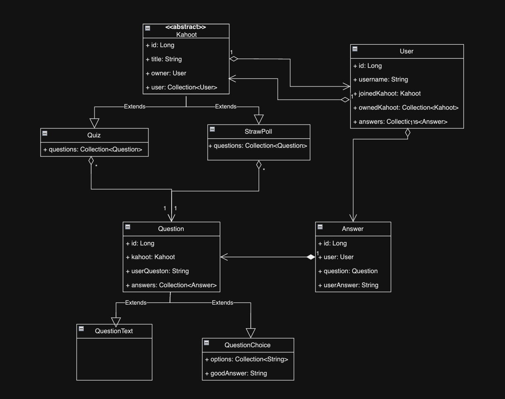

Auteurs :

[GILLARD Mathis](mathis.gillard@etudiant.univ-rennes.fr)

[HURBAIN Raphaël](raphael.hurbain@etudiant.univ-rennes.fr)

---

> > ### 🌳 Les différentes branches :
> - #### TP Spring : [master](https://gitlab.istic.univ-rennes1.fr/rhurbain/tpjpa2024.git)
> - #### TP JaxRS : [jax-rs](https://gitlab.istic.univ-rennes1.fr/rhurbain/tpjpa2024/-/tree/jax-rs?ref_type=heads)
> - #### TP Servlet [servlet](https://gitlab.istic.univ-rennes1.fr/rhurbain/tpjpa2024/-/tree/servlet?ref_type=heads)


# TP-TAA

## Sommaire
0. [Lien utile]()
1. [Installation et lancement du projet](#1---installation-et-lancement-du-projet)
2. [Présentation du modèle métier](#2--présentation-du-modèle-métier)
3. [Persistance des données (JPA)](#3---persistance-des-données-jpa)
  - [A - L'annotation de base](#a---la-annotation-de-base)
  - [B - Les relations](#b---les-relations)
4. [Communication avec la base de données (Data Layer)](#4---communication-avec-la-base-de-donnée-data-layer)
  - [A - Version 1 : Data Access Object (DAO)](#a--version-1--data-access-object-dao)
  - [B - Version 2 : Spring Repository](#b---version-2--spring-repository)
5. [Partie métier / controller](#5---partie-métier--controller)
  - [A - Data Transfer Object (DTO)](#a---data-transfer-object-dto)
  - [B - Mapping entité vers DTO (MapStruct)](#b---mapping-entité-vers-dto-mapstruct)
  - [C - Logique métier (Service)](#c---logique-métier-service)
  - [D - Gestion des Exceptions (ExceptionHandler)](#d--gestion-des-exceptions-exceptionhandler)
  - [E - Controller (JAX-RS et annotations Spring)](#e--controller-jax-rs-et-annotations-spring)
6. [Documentation Swagger (OpenAPI)](#6---documentation-swagger-openapi)
7. [Gestion d'autorisation (Keycloak)](#7---gestion-des-autorisations))
8. [Log avec la programmation par aspect (AOP)](#8---log-avec-la-programmation-par-aspect-aop)

---
## Lien utile
- ### [Interface web Swagger](http://localhost:8080/swagger-ui/index.html#/)
- ### [Interface web keycloack](http://localhost:8180/admin/master/console/)


---


## 1 - Installation et lancement du projet

Les différentes étapes pour lancer l'application sont les suivantes :
- lancer la base de donnée (contenant les données de l'api Kahoot). en faisant `./run-hsqldb-server.sh` ou `./run-hsqldb-server.bat` depuis la racine du projet.
- Lancer le conteneur docker pour keycloack. En tapant la commande : `./docker/docker-compose up -d` depuis la racine du projet.
- Lancer l'application Spring-Boot `Tpjpa2024SpringApplication.java`.

Normalement l'interface swagger sera alors disponible. Et chaque controller ne nécessitant pas d'autorisation particulière peuvent être testé.

> Certains endpoint de KahootController nécéssite l'autorisation `ADMIN` ou `USER`
> - `getAll` --> `ADMIN`
> - `deleteKahoot` --> `USER`

Pour les tester, deux utilisateurs ont été créer un ADMIN (User + Admin) et un simple User. Il est possible de récupérer leurs tokens respectifs grace aux commandes :

`USER`:
```bash
curl --location 'http://localhost:8180/realms/KahootRealm/protocol/openid-connect/token' --header 'Content-Type: application/x-www-form-urlencoded' --data-urlencode 'username=user' --data-urlencode 'password=dupont' --data-urlencode 'grant_type=password' --data-urlencode 'client_id=kahootApp' |jq
```

`ADMIN`:
```bash
curl --location 'http://localhost:8180/realms/KahootRealm/protocol/openid-connect/token' --header 'Content-Type: application/x-www-form-urlencoded' --data-urlencode 'username=admin' --data-urlencode 'password=admin123' --data-urlencode 'grant_type=password' --data-urlencode 'client_id=kahootApp' |jq
```

Ces deux tokens peuvent être utilisés directement depuis swagger en cliquant sur **Autorize** en haut à droite.


## 2 -Présentation du modèle métier
Le modèle métier de l'application :



## 3 - Persistance des données (JPA)

### A - La annotation de base
Pour l'ensemble des classes de notre modèle de donnée, nous avons ajouté les annotations pour pouvoir les mapper avec notre Base de donnée (*hsqldb*). Voici un exemple de ce qui a été fait :

```java
@Entity  
public abstract class Kahoot {  
  
    @Id  
    @GeneratedValue    
    private Long id;  
  
	//Reste des attributs

	//getter & setter
}
```

- `@Entity` indique que notre POJO (plain old java object) sera une table dans notre base de donnée.
- `@Id` indique que l'attribut désigné sera la clé primaire dans notre table.
- `@GeneratedValue`Indique la manière dont l'id va être géré. Par défaut la gestion de cette id est confié à la base de donnée. (*chose qui pourrait changer si on souhaite utiliser les mêmes id que ceux générés par keycloack*)

### B - Les relations

En plus des éléments ajoutés dans la partie précédente, nous devons également gérer l'ensemble des relations entre les entités.
En gardant l'exemple du kahoot, on va se concentrer sur une première relation 1 -> N **(One to Many**)

class **Kahoot** :
```java
@Entity  
@Data  
public abstract class Kahoot {  
  
	//Autres attributs
  
    @ManyToOne  
	private User owner;

	//getters & setter
}
```

class **User** :
```java
@Entity  
public class User {  

	//autres attributs
  
    @OneToMany(mappedBy = "owner")  
    private Collection<Kahoot> ownedKahoot;  

	//autrs attributs 
	//getters & setters
  
}
```
> Cette relation indique qu'un Kahoot a un créateur, et qu'un utilisateur peut être le créateur/propriétaire d'un ou plusieurs Kahoot(s).


## 4 - Communication avec la base de donnée (Data Layer)

### A -**Version 1 :**  Data Access Object (DAO)

Pour gérer l'accès à la base de donnée sans Spring en utilisant des Data Access Object, nous avons fait le choix d'essayer de faire un premier Dao generic qui pourrait être complété si nécessaire par chaque entités.

Pour ce faire, on a d'abord déclaré une première interface avec les méthodes importantes pour le projet.

**Interface IGenericDao :**
```java
public interface IGenericDao<K, T> {  
  
    T findOne(final K id);  
  
    List<T> findAll();  
  
    void save(final T entity);  
  
    void update(final T entity);  
  
    void delete(final T entity);  
  
    void deleteById(final K entityId);  
}
```
Ensuite une classe abstraite s'occupe de fournir l'implémentation de cette class de manière générique.

**Interface AbstractJpaDao :**
```java
public abstract class AbstractJpaDao<K, T> implements IGenericDao<K, T> {  
  
    @Setter  
    private Class<T> clazz;  
  
    protected EntityManager entityManager;  
  
    public AbstractJpaDao(Class<T> clazz) {  
        this.entityManager = EntityManagerHelper.getEntityManager();  
        this.clazz = clazz;  
    }  
  
    public T findOne(K id) {  
        return entityManager.find(clazz, id);  
    }  
  
    public List<T> findAll() {  
        return entityManager.createQuery("select e from " + :className + " as e", clazz).getResultList();  
    }

//Reste des méthode implémenté
}
```

Pour voir le reste des méthodes implémenté [cliquer-ici](lien vers la class complète)

Et finalement pour chaque entité, on aura une interface qui va étendre notre interface générique (**IGenericDao**).

On va retrouver par exemple `IKahootDAO` :

```java
public interface IKahootDao extends IGenericDao<Long, Kahoot> {  
  
    Kahoot findKahootByPin(Long pin);  
}
```

Avec sa class d'implémentation qui ne nécessitera pas d'implémenter les méthodes génériques, mais seulement les méthodes personnalisées :

```java 
public class KahootDaoImpl extends AbstractJpaDao<Kahoot, Long> implements KahootDao {

    public KahootDaoImpl() {
        super(Kahoot.class);
    }

    @Override
    public Kahoot findKahootByPin(Long pin) {
        Query mediaQuery = entityManager.createQuery(
                "select e from Kahoot as e WHERE e.pin = :pin",
                Kahoot.class);
        mediaQuery.setParameter("pin", pin);
        return (Kahoot) mediaQuery.getSingleResult();
    }
}
```

### B -  **Version 2 :** Spring Repository

Pour la deuxième version du projet, nous n'avons pas eu à implémenter de Data Access Object (**DAO**) Nous avons simplement défini des Interfaces telles que `KahootRepository` :

```java
public interface KahootRepository extends JpaRepository<Kahoot, Long> {  
}
```

Elles étendent l'interface `JpaRepository` en définissant le type de l'entité concernée ainsi que le type de l'identifiant.

Aucune implémentation de cette **class** n'est nécessaire, Spring Boot s'en chargera.

Il est tout de même possible de rajouter des requêtes personalisées. La première méthode consiste à utiliser le langage `JPQL`. Depuis Spring, on peut le faire directement comme ceci :

> `KahootRepository`
>```java
>    @Query("SELECT k FROM Kahoot k WHERE k.owner.id = :ownerId")
>    List<Kahoot> findKahootsByOwner(@Param("ownerId") Long ownerId);
>```

On peut également (seulement avec le farmework Spring) simplement écrire une requête telle que :

`QuestionRepository`
>```java
>    List<Question> findQuestionsByKahootId(Long kahootId);
>```


## 5 - Partie métier / controller

### A - Data Transfer Object (DTO)

Dans ce projet, on utilise les **Data Transfer Objects (DTO)** pour simplifier l'échange de données entre les différentes parties de l'application, notamment entre le backend (Spring Boot) et les clients qui consomment notre API.

Les DTO permettent aussi de maintenir une séparation claire entre les entités du domaine (qui représentent les données internes de l'application) et les objets utilisés par le contrôleur. Cela évite d'exposer directement les entités de la base de données aux clients, ce qui protège la structure interne et facilite l'évolution de l'application sans impacter l'API.

En gardant l'exemple de l'entité Kahoot voici à quoi va ressembler son DTO (sous forme d'un record):
```java 
public record KahootDto(Long id, String title, Long pin, KahootType kahootType) {  
}
```

### B - Mapping entité vers DTO (MapStruct)

Pour passer d'une entité à un DTO et inversement, il faut faire appel à un Mapper. Nous allons pour la suite utiliser `MapStruct`.

Le cas du Kahoot dans notre projet est un bon exemple d'utilisation de MapStruct. En effet s'agissant d'une classe abstraite On ne pouvait pas savoir si nous allions récupérer un DTO d'une de ces classes d'implémentation (Quiz ou StrawPoll).
Nous avons donc décidé de renvoyer un KahootDto contenant les paramètres génériques d'un Kahoot en plus d'un Type indiquant s'il s'agissait d'un Quiz ou d'un StrawPol.

### C - Logique métier (Service)

Pour présenter la partie Service de notre API, nous allons présenter une méthode qui est probablement la plus parlante.

```java
@Transactional  
@Override  
public KahootDto createKahoot(KahootDto kahootDto, Long userId) {  
    if (kahootDto == null) {  
        throw new ValidationException("The kahoot DTO cannot be null.");  
    }  
    if (kahootDto.id() != null) {  
        throw new IllegalIdOnCreateException("The kahoot ID must not already be defined at the time of creation.");  
    }  
    if (userId == null) {  
        throw new ValidationException("The User Id cannot be null.");  
    }  
  
    User user = userRepository.findById(userId)  
            .orElseThrow(() -> new UserNotFoundException(userId));  
  
    Kahoot kahoot = kahootMapper.toEntity(kahootDto);  
    kahootRepository.save(kahoot);  
  
    user.getOwnedKahoot().add(kahoot);  
    userRepository.save(user);  
  
    return kahootMapper.toDto(kahoot);  
}
```

Dans un premier temps le service createKahoot va recevoir en paramètre un `KahootDto`.
Le service va tout d'abord faire quelques vérifications telles que le kahootDto ne doit pas être null. L'id du `KahootDto`doit être nul, sinon en enregistrant en base de donnée avec un id incorrect une Exception serait renvoyée (Ces controles pourraient potentiellement être réalisés grâce à l'**AOP**).

Après avoir vérifié tout cela, on va récupérer un Utilisateur et évidement renvoyer une Exception en cas d'erreur.

Finalement, nous allons utiliser notre `Mapper` pour obtenir une entité grâce à notre DTO puis finalement l'enregistrer.

Pour assurer la **transitivité de persistance**, nous allons ajouter le kahoot précédemment enregistré à l'utilisateur qu'on vient de récupérer, et l'enregistrer à son tour.

Le kahoot est créé, il ne reste donc plus qu'à le retourner.

### D- Gestion des Exceptions (ExceptionHandler)
##### ℹ️ **PARTIE SPRING UNIQUEMENT**ℹ️

Grâce à son fonctionnement, le framework Spring Boot permet d'attraper et traiter n'importe quelle Exception.
Pour ce faire, nous avons implémenté une class `CustomExceptionHandler`

Son role va être d'effectuer un traitement spécifique en fonction de certaines Exceptions choisit.
Par exemple pour gérer le cas ou une entité n'est pas trouvée, nous allons pouvoir faire appel à la méthode `handleNotFound`.
```java

@ExceptionHandler({KahootNotFoundException.class, AnswerNotFoundException.class, QuestionNotFoundException.class, UserNotFoundException.class})  
protected ResponseEntity<Object> handleNotFound(Exception ex, WebRequest request) {  
    Map<String, String> responseBody = new HashMap<>();  
    responseBody.put("error", "Not Found");  
    responseBody.put("message", "Ressource non trouvée");  
  
    return handleExceptionInternal(ex, responseBody, new HttpHeaders(), HttpStatus.NOT_FOUND, request);  
}
```

Celle-ci renverra une **ResponseEntity** au format json avec la raison et le status HTTP. Évitant ainsi la multiplication de try catch partout dans le code.


### E -Controller (JAX-RS, et annotations Spring)

##### E.1 - JAX-RS

Dans une application RESTful utilisant JAX-RS, les "ressources" sont des classes qui définissent et gèrent les endpoints de l'API. Chaque ressource correspond généralement à une entité métier (comme `Kahoot` dans cet exemple) et permet d'effectuer des opérations CRUD (Créer, Lire, Mettre à jour, Supprimer) sur cette entité à travers des requêtes HTTP.

```java
@Path("/api/kahoot")
@Produces(MediaType.APPLICATION_JSON)
@Consumes(MediaType.APPLICATION_JSON)
public class KahootResource {

    KahootService kahootService;

    public KahootResource() {
        this.kahootService = new KahootServiceImpl(
                new KahootDaoImpl(),
                new UserDaoImpl(),
                KahootMapper.instance
        );
    }

    @POST
    @Path("/createKahoot/{userId}")
    public Response createKahoot(KahootDto kahootDto, @PathParam("userId") Long userId) {
        KahootDto createdKahoot = kahootService.createKahoot(kahootDto, userId);
        return Response.status(Response.Status.CREATED)
                .entity(createdKahoot).build();
    }

    @GET
    @Path("/{kahootId}")
    public Response getKahootById(@PathParam("kahootId") Long kahootId) {
        KahootDto kahoot = kahootService.findKahootById(kahootId);
        return Response.status(Response.Status.OK).entity(kahoot).build();
    }

    @GET
    @Path("/getAll")
    public Response getAllKahoot() {
        List<KahootDto> kahoots = kahootService.findALl();
        return Response.status(Response.Status.OK).entity(kahoots).build();
    }

    @DELETE
    @Path("/{kahootId}")
    public Response deleteKahoot(@PathParam("kahootId") Long kahootId) {
        kahootService.deleteKahoot(kahootId);
        return Response.noContent().build();  // Retourne un statut 204 No Content si la suppression est réussie
    }

    @PUT
    @Path("/updateKahoot")
    public Response updateKahoot(KahootDto kahootDto) {
        KahootDto updatedKahoot = kahootService.updateKahoot(kahootDto);
        return Response.status(Response.Status.OK).entity(updatedKahoot).build();
    }
}
```

Annotations JAX-RS utilisées :

- `@Path`: Spécifie le chemin de l'endpoint.
- `@POST`, `@GET`, `@PUT`, `@DELETE`: Définissent le type de méthode HTTP à utiliser (POST pour créer, GET pour lire, PUT pour mettre à jour, DELETE pour supprimer).
- `@Consumes`: Indique le type de données que l'API accepte en entrée (ici, JSON).
- `@Produces`: Indique le format de la réponse (ici, JSON).
- `@PathParam`: Lie un paramètre d'URL à une variable de méthode.

##### E.2 - Annotation Spring

Pour déclarer un Controller en Spring la logique reste la même qu'avec JaxRS, avec de légères différences. On constate tout de même la simplification qu'a pu apporter le CustomExceptionHandler en traitant les Exceptions. Ne laissant plus que les appels services.

```java
@RestController  
@RequestMapping(value = "/api/kahoot")  
public class KahootController {  
 
    @PostMapping("/createKahoot/{userId}")  
    public ResponseEntity<KahootDto> createKahoot(KahootDto kahootDto, @PathVariable Long userId) {  
        return ResponseEntity.status(HttpStatus.CREATED)  
                .body(kahootService.createKahoot(kahootDto, userId));  
    }  
  
  
    @GetMapping("/{kahootId}")  
    public ResponseEntity<KahootDto> getKahootById(@PathVariable Long kahootId) {  
        return ResponseEntity.status(HttpStatus.CREATED)  
                .body(kahootService.findKahootById(kahootId));  
    }  
  
  
    @GetMapping("/getAll")  
    public ResponseEntity<List<KahootDto>> getAllKahoot() {  
        return ResponseEntity.status(HttpStatus.OK)  
                .body(kahootService.findALl());  
    }  
  
  
    @DeleteMapping("/{kahootId}")  
    public ResponseEntity<Void> deleteKahoot(@PathVariable Long kahootId) {  
        kahootService.deleteKahoot(kahootId);  
        return ResponseEntity.noContent().build();  // Retourne un statut 204 No Content si la suppression est réussie  
    }  
  
   
    @PutMapping("/updateKahoot")  
    public ResponseEntity<KahootDto> updateKahoot(@RequestBody KahootDto kahootDto) {  
        KahootDto updatedKahoot = kahootService.updateKahoot(kahootDto);  
        return ResponseEntity.status(HttpStatus.OK).body(updatedKahoot);  
    }  
}
```

On retrouve ces annotations :
- `@RestController` : Indique que la classe est un contrôleur web dans une application Spring MVC. Elle combine les annotations `@Controller` et `@ResponseBody`, ce qui signifie que les méthodes de la classe retourneront directement les données JSON/XML au lieu de rendre une vue (template HTML).

- `@RequestMapping(value = "/api/kahoot")` : Elle mappe les requêtes HTTP entrantes sur des méthodes de gestion spécifiques d'un contrôleur. Le chemin `/api/kahoot` est utilisé comme point de base pour toutes les routes définies dans cette classe, ce qui signifie que toutes les routes commençant par ce chemin seront gérées ici.

- `@PostMapping("/createKahoot/{userId}")` : Cette annotation est utilisée pour gérer une requête HTTP POST. Elle est associée à une méthode qui permet de créer un nouveau Kahoot en utilisant l'ID de l'utilisateur passé en paramètre de chemin `{userId}`.

- `@GetMapping("/{kahootId}")` : Cette annotation est utilisée pour gérer les requêtes HTTP GET. Elle permet de récupérer un Kahoot spécifique en fonction de son ID, passé en tant que paramètre de chemin `{kahootId}`.

- `@DeleteMapping("/{kahootId}")` : Utilisée pour gérer une requête HTTP DELETE, cette annotation permet de supprimer un Kahoot spécifique identifié par son ID dans l'URL.

- `@PutMapping("/updateKahoot")` : Cette annotation gère les requêtes HTTP PUT. Elle est utilisée pour mettre à jour un Kahoot existant. Les données du Kahoot à mettre à jour sont souvent envoyées dans le corps de la requête.

## 6 - Documentation swagger (OpenAPI)

Pour faciliter la documentation et au passage le test de notre API, nous avons utilisé la library openAPI. Une fois installée dans notre projet grace au `pom.xml`nous avons créé un fichier `SwaggerConfig.java` une classe permettant de définir les paramètres de base de notre API.

Et finalement, pour documenter l'ensemble de nos Endpoints, nous avons utilisé plusieurs annotations fournies. En prenant l'exemple du KahootController avec l'endpoint :
```java
@Operation(summary = "Create kahoot", description = "Create either a Quiz or a StrawPoll based on the KahootType")
@ApiResponses(value = {
        @ApiResponse(responseCode = "201", description = "Kahoot created",
                content = {@Content(mediaType = "application/json",
                        schema = @Schema(implementation = KahootDto.class)
                )})
})
@PostMapping("/createKahoot/{userId}")
public ResponseEntity<KahootDto> createKahoot(@RequestBody KahootDto kahootDto, @PathVariable Long userId) {
        ...
}

```

- Annotations dans KahootController :

  - Utilisation de `@Operation` pour définir des résumés et des descriptions clairs pour chaque méthode.
  - Ajout de `@ApiResponses` pour spécifier les codes de réponse HTTP et les schémas de contenu, comme pour KahootDto.

- Documentation des méthodes : Par exemple, pour createKahoot :
  - Résumé : Création d'un Kahoot.
  - Description : Création d'un quiz ou d'un sondage.


## 7 - Gestion des autorisations

Pour gérer les autorisations dans notre application nous avons utilisé le service `keycloack`. Pour ce faire, nous avons créé un `docker-compose.yml` gérant la création d'une base de donnée postgres (pour stocker les utilisateurs du service keycloack) ainsi que la création d'une instance de keycloack.

> Pour gérer une certaine persistance des données permettant aux correcteurs d'utiliser nos utilisateurs, nous utilisons un fichier `backup.sql` une requête sql pour peupler la base.

Une fois lancer ***(cf. installation et lancement du projet)*** l'inteface administrateur de keycloack est disponible à l'adresse [http://localhost:8180](http://localhost:8180).


Pour utiliser Keycloak dans notre application, nous avons créé un fichier de configuration config/WebSecurityConfig. Ce fichier a pour rôle de :

- Désactiver la protection CSRF (car elle n'est pas nécessaire pour les API stateless qui utilisent des tokens JWT pour l'authentification).
- Autoriser certaines requêtes, comme celles de Swagger et des API (par exemple : /swagger-ui/**, /v3/api-docs/**, /api/kahoot/**, etc.), sans nécessiter d'authentification.
- Exiger une authentification pour toutes les autres requêtes.

Et pour définir quel niveau d'autorisation d'un controller, nous ajoutons une annotation au-dessus du controller :
- `@PreAuthorize("hasRole('USER')")`
- `@PreAuthorize("hasRole('ADMIN')")`

## 8 - Log avec la programmation par aspect (AOP)

Ce projet utilise un aspect pour intercepter les appels aux méthodes des contrôleurs. Grâce à la programmation orientée aspect (AOP), nous pouvons intercepter les points d'exécution dans le code appelés **Pointcuts** et définir des actions transversales comme le logging.

## Explication des concepts

- **Aspect** : Un module qui contient une préoccupation transversale, ici, le logging des requêtes et réponses HTTP.
- **Pointcut** : Un point dans le code où l'aspect doit s'appliquer. Dans cet exemple, nous appliquons l'aspect à chaque méthode d'un contrôleur REST.
- **Advice** : L'action à exécuter dans l'aspect, par exemple, enregistrer les informations d'une requête HTTP.

## Fonctionnement

1. **Logging des requêtes entrantes** : À chaque appel d'une méthode d'un contrôleur, nous enregistrons la méthode HTTP, le chemin de la requête et les paramètres envoyés grâce à la méthode `logRequest()`.
    ```java
    @Before("controller()")
    public void logRequest(JoinPoint joinPoint) {
        HttpServletRequest request = getCurrentHttpRequest();
        log.info("Méthode HTTP : {}({}), Paramètres : [{}]",
                request.getMethod(),
                request.getServletPath(),
                createJoinPointForLogs(joinPoint));
    }
    ```

2. **Logging des réponses** : Après que le contrôleur a exécuté une méthode et retourne une réponse, celle-ci est enregistrée avec la méthode `logsResponse()`.
    ```java
    @AfterReturning(pointcut = "controller() || controllerAdvice()", returning = "response")
    public void logsResponse(Object response) {
        log.info("Réponse HTTP : {}", response != null ? response : "Réponse est null");
    }
    ```

3. **Utilisation de `HttpServletRequest`** : Nous récupérons les informations relatives à la requête HTTP (méthode, chemin, etc.) en utilisant l'objet `HttpServletRequest` :
    ```java
    private HttpServletRequest getCurrentHttpRequest() {
        ServletRequestAttributes attributes = (ServletRequestAttributes) RequestContextHolder.getRequestAttributes();
        return attributes.getRequest();
    }
    ```

## Exemple de log produit

Voici un exemple de ce qui est logué lorsqu'une requête `POST` est envoyée à l'API pour créer un utilisateur, et que la réponse HTTP est renvoyée par le contrôleur :

```
2024-10-18T18:08:59.912+02:00  INFO 8048 --- [tpjpa2024-spring] [io-8080-exec-10] f.i.t.application.aspect.LoggingAspect   : HTTP Method: POST(/api/users/createUser), Parameters: [[UserDto[username=test aop, id=0]]]
2024-10-18T18:09:00.031+02:00  INFO 8048 --- [tpjpa2024-spring] [io-8080-exec-10] f.i.t.application.aspect.LoggingAspect   : HTTP Response: <201 CREATED Created,User created,[]>
```

Ce système de logging fournit un moyen efficace de suivre les interactions HTTP dans l'application, facilitant ainsi le débogage et la surveillance.